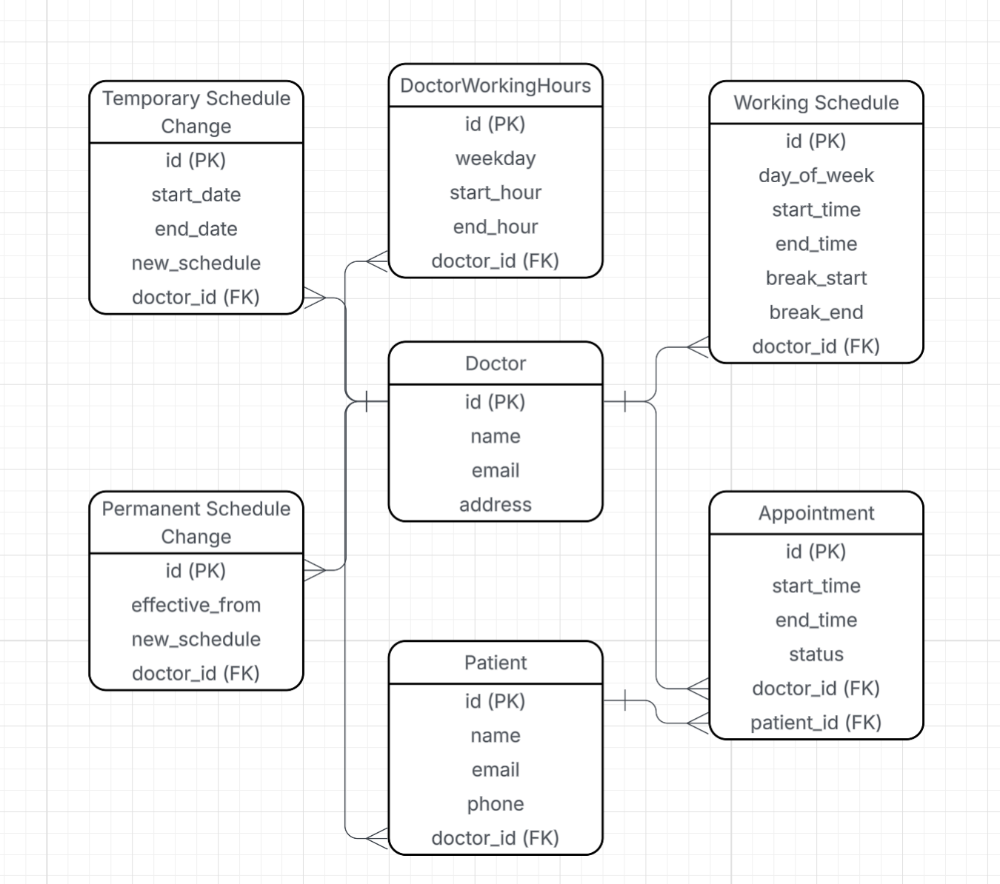
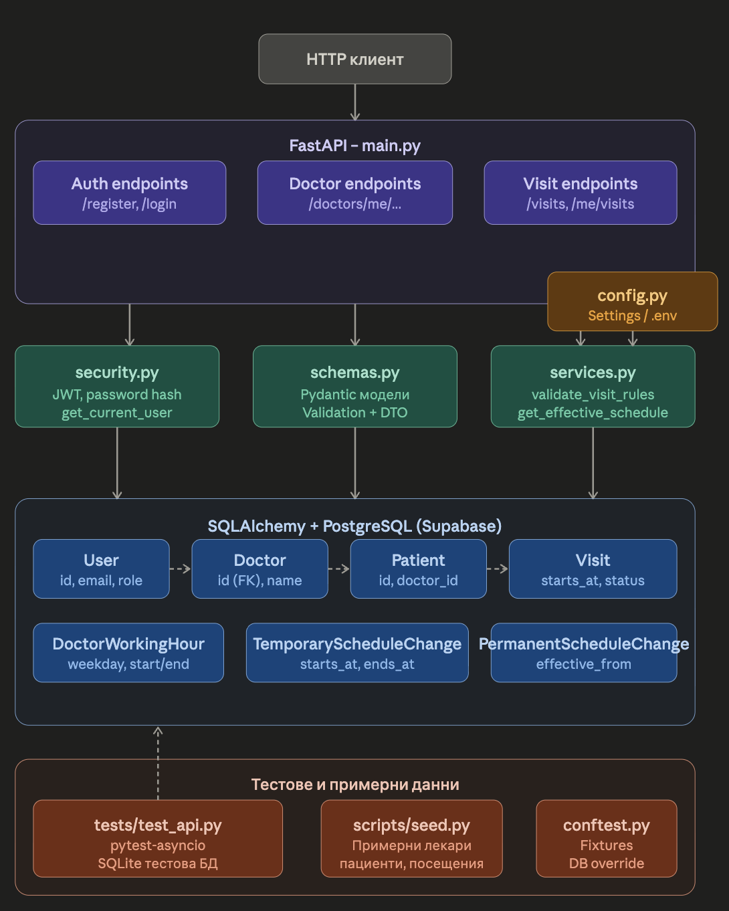

# Документация на курсов проект
## Система за записване на посещения при лични лекари

Боян Герасимов

---

## 1. Ползване на API

### 1.1 Формат и достъп

- Всички операции са достъпни през HTTP API.
- Данните се подават и връщат в JSON формат.
- За защитените операции се използва Bearer token в `Authorization` header.

### 1.2 Основни входни и изходни структури

#### Регистрация на лекар

Request:

```json
{
  "name": "Dr. Ivan Petrov",
  "email": "doctor@example.com",
  "password": "password123",
  "address": "Sofia, Mladost 1",
  "weekly_schedule": [
    {
      "weekday": 0,
      "intervals": [
        {"start": "08:30:00", "end": "12:00:00"},
        {"start": "13:00:00", "end": "18:30:00"}
      ]
    }
  ]
}
```

Response:

```json
{
  "access_token": "<jwt_token>",
  "token_type": "bearer"
}
```

#### Регистрация на пациент

Request:

```json
{
  "name": "Georgi Ivanov",
  "email": "patient@example.com",
  "password": "password123",
  "phone": "+359888111222",
  "doctor_id": "<doctor_uuid>"
}
```

Response:

```json
{
  "access_token": "<jwt_token>",
  "token_type": "bearer"
}
```

#### Създаване на посещение

Request:

```json
{
  "starts_at": "2026-05-21T10:00:00Z",
  "ends_at": "2026-05-21T10:30:00Z"
}
```

Response:

```json
{
  "id": "<visit_id>",
  "doctor_id": "<doctor_id>",
  "patient_id": "<patient_id>",
  "starts_at": "2026-05-21T10:00:00Z",
  "ends_at": "2026-05-21T10:30:00Z",
  "status": "active",
  "cancelled_by": null
}
```

### 1.3 Endpoint-и

Публични:

- `POST /auth/register/doctor`
- `POST /auth/register/patient`
- `POST /auth/login`

Защитени:

- `PUT /doctors/me/working-hours`
- `POST /doctors/me/temporary-working-hours`
- `POST /doctors/me/permanent-working-hours`
- `POST /patients/me/visits`
- `POST /visits/{visit_id}/cancel`
- `GET /me/visits`

### 1.4 HTTP кодове и съобщения за грешки

- `400 Bad Request`
  - `Visit must be created at least 24 hours in advance`
  - `Visit must be inside doctor working hours`
  - `Visit overlaps with another visit`
  - `Visit cannot be cancelled later than 12 hours before start`
- `401 Unauthorized`
  - `Could not validate credentials`
- `403 Forbidden`
  - операцията не е позволена за ролята на текущия потребител
- `404 Not Found`
  - `Doctor not found`
  - `Patient not found`
  - `Visit not found`

---

## 2. Архитектура на проекта

### 2.1 Ключови класове, структури и методи

- `app/main.py`
  - реализира endpoint-ите и заявките към бизнес логиката
- `app/models.py`
  - ORM модели: `User`, `Doctor`, `Patient`, `DoctorWorkingHour`, `TemporaryScheduleChange`, `PermanentScheduleChange`, `Visit`


- `app/schemas.py`
  - входни/изходни DTO структури и базова валидация на данни
- `app/security.py`
  - `hash_password()`, `verify_password()`, `create_access_token()`, `get_current_user()`
- `app/services.py`
  - основни бизнес методи и правила при записване/отмяна
- `app/database.py`
  - конфигурация на engine и async сесии
- `app/config.py`
  - конфигурация чрез environment променливи

### 2.2 Обосновка на архитектурните решения

- Използвана е слоеста структура (API, бизнес логика, модели/достъп до данни), за да се разделят отговорностите.
- Бизнес правилата са концентрирани в сервизен слой, което прави логиката по-четима и по-лесна за тестване.
- Използван е JWT за статeless оторизация на защитените endpoint-и.
- SQLAlchemy ORM е използван за стандартизиран достъп до PostgreSQL и по-лесна поддръжка на моделите.



---

## 3. Самоанализ

### 3.1 Къде са спазени принципите за чист и четим код (SOLID)

- Отговорностите са разделени по модули (Single Responsibility): отделни файлове за API, сигурност, модели, бизнес логика.
- Разширяемостта е добра: могат да се добавят нови endpoint-и и правила без промяна на всички модули.
- Използвани са ясни структури за вход/изход чрез Pydantic схеми, което подобрява четимостта и надеждността.

### 3.2 Къде не са спазени напълно

- Част от логиката в endpoint-ите все още съдържа проверки, които могат допълнително да се изнесат в сервизния слой.
- Няма пълно abstraction ниво за repository pattern между бизнес логиката и ORM слоя.

### 3.3 Защо не са спазени напълно

- Проектът е реализиран в рамките на курсова задача и фокусът е върху пълно покриване на функционалните изисквания.
- Избран е по-прагматичен подход, за да се гарантира работеща система с ясна и стабилна основа.
